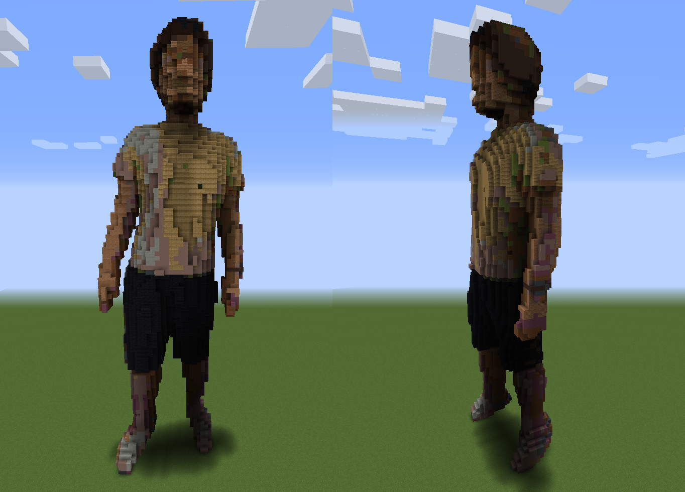

# obj2schematic

Convert [Wavefront `.obj` file](#Supported-`.obj`-format) to [Minecraft `.schematic` file](https://minecraft.gamepedia.com/Schematic_file_format)

**input `.obj`**


**output `.schematic`**


## Supported `.obj` format

### 1. geometric vertices with `(x, y, z, r, g, b)`

From [Wavefront .obj file Wiki](https://en.wikipedia.org/wiki/Wavefront_.obj_file)

> Geometric vertex
A vertex can be specified in a line starting with the letter v. That is followed by (x,y,z[,w]) coordinates. W is optional and defaults to 1.0. **Some applications support vertex colors, by putting red, green and blue values after x y and z. The color values range from 0 to 1.**


*`.obj` sample*

```txt
# v (x) (y) (z) (red) (green) (blue)
v -0.3438 -0.1250 0.0312 0.4563 0.3357 0.2624
v -0.3438 -0.1250 0.0296 0.4552 0.3348 0.2617
v -0.3438 -0.1256 0.0312 0.4548 0.3343 0.2613
v -0.3438 -0.1250 0.0369 0.4579 0.3367 0.2631
v -0.3444 -0.1172 0.0234 0.4736 0.3508 0.2737
v -0.3438 -0.1172 0.0186 0.4751 0.3515 0.2738
v -0.3438 -0.1223 0.0234 0.4610 0.3400 0.2655
v -0.3448 -0.1172 0.0312 0.4752 0.3522 0.2750
v -0.3438 -0.1247 0.0391 0.4596 0.3380 0.2640
v -0.3446 -0.1172 0.0391 0.4747 0.3515 0.2741
:
```

### 2. `.obj` with `.mtl`

*`.obj` sample*

```txt
# OBJ File:

mtllib ./result.mtl

# vertices:
v -9.1863 9.1863 -5.0000
v -8.8947 9.1863 -5.0000
v -8.6904 9.2796 -6.0667
:

# vertice textures:
vt 0.0000 1.0000
vt 0.0159 1.0000
vt 0.0317 1.0000
:

# vertice normals:
vn -0.0000 0.0000 1.0000
vn -0.0000 0.0000 1.0000
vn -0.0000 0.0000 1.0000
:

# faces:

usemtl tex
f 1/1/1 65/65/65 4097/4097/4097
f 2/2/2 66/66/66 4098/4098/4098
f 3/3/3 67/67/67 4099/4099/4099
:
```

*`.mtl` sample*

```txt
newmtl tex
Ka 1.0000 1.0000 1.0000
Kd 1.0000 1.0000 1.0000
Ks 0.0000 0.0000 0.0000
d 1.0
illum 0
map_Kd ./img.png
```

## How to Use

### 1. Clone this repo

```bash
$ git clone https://github.com/takecx/obj2schematic.git
$ cd obj2schematic
```

### 2. Create Environment

You should create python environment using `requirements.txt`.

```bash
$ conda create -n obj2schematic python=3.7
$ conda activate obj2schematic
$ pip install -r requirements.txt
```

### 3. Prepare input `.obj` file

Put input `.obj` file to `./data/` dir for example.

### 4. Run script

Run `Obj2SchematicConverter.py` with some arguments.

```bash
$ python Obj2SchemticConverter.py (.obj_file) --output_dir (output dir) --h_max (height max value) --w_max (width max value)
```

#### Arguments

1. input `.obj` file (**required**)
2. `--output_dir` : Output dir of generated .schematic file (optional)
3. `--h_max` : max height of converted schematic (optional)
4. `--w_max` : max width(length) of converted schematic (optional)

For example, 

- input `.obj` file : `./data/sample_data.obj`
- `--output_dir` : `./output/`
- `--h_max` : `100`
- `--w_max` : `150`

then, you run 

```bash
$ python Obj2SchemticConverter.py ./data/sample_data.obj --output_dir ./output/ --h_max 100 --w_max 150
```

### 5. Import `.schematic` to your Minecraft World!!

Import generated `.schematic` file to your own Minecraft World using [WorldEdit mod](https://www.curseforge.com/minecraft/mc-mods/worldedit).
